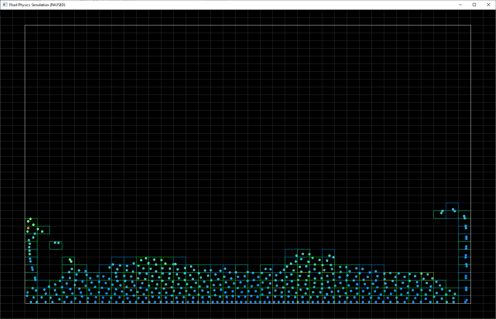

# Fluid_Physics_Simulation



[Demo](https://youtu.be/dvEPeeAJQFo) showing reset and neighbor grid display.

Original code by Spleen0291. Optimized, QoL and cleanup by me.

# Optimizations

| Description         | ms/frame | Branch | % Faster |
|:--------------------|---------:|:-------|---------:|
| Original            | 4.312 ms | [cleanup_benchmark](https://github.com/Michaelangel007/Fluid_Physics_Simulation/tree/cleanup_benchmark)                |   0% |
| Particle Properties | 4.312 ms | [cleanup_particle](https://github.com/Michaelangel007/Fluid_Physics_Simulation/tree/cleanup_particle)                  |   0% |
| Neighbor index      | 3.844 ms | fluid cleanup                                                                                                          |  12% |
| Fixed Neighbor array| 1.329 ms | [fluid cleanup](https://github.com/Michaelangel007/Fluid_Physics_Simulation/tree/fluid_cleanup)                        | 224% |
| Cache kernel scalars| 1.236 ms | [kernel_optimizations](https://github.com/Michaelangel007/Fluid_Physics_Simulation/tree/kernel_optimizations)          | 248% |
|1-pass find neighbors| 0.825 ms | [cleanup_spatial_partition](https://github.com/Michaelangel007/Fluid_Physics_Simulation/tree/cleanup_spatial_partition)| 422% |
| Multithread support | 0.407 ms | [multithread_support](https://github.com/Michaelangel007/Fluid_Physics_Simulation/tree/multithread_support)            | 959% |
| Parallel hashmap    | 0.370 ms | [parallel_hashmap](https://github.com/Michaelangel007/Fluid_Physics_Simulation/tree/parallel_hashmap)                  |1065% |
| Multithread pressure| 0.295 ms | [update_pressure](https://github.com/Michaelangel007/Fluid_Physics_Simulation/tree/update_pressure)                    |1361% |

# Command Line Options

The command line options can be displayed with `-?` or `--help`:

```
-?              Display command line options and quit.
--help          Alias for -?.
-benchmark      Run simulation for 3 minutes (~10,800 frames @ 60fps), render first frame at frame number 7,200.
-benchfast      Run simulation for 10 seconds (~600 frames @ 60fps), render first frame at frame number 300.
-createcenter   Generate particles in grid centers. (DEFAULT.)
-createrandom   Generate particles in random positions.
-h              Specifiy grid height (rows). (DEFAULT 20 rows.)
-height         Alias for -h.
-j #            Use specified number of threads. (DEFAULT is max detected.)
-pause          Pause at both stand and end of simulation waiting for ENTER to be pressed.
-pausestart     Pause at start of simulation waiting for ENTER to be pressed.
-pauseend       Pause at end of simulation waiting for ENTER to be pressed.
-render #       Don't render until specified frame number. -1 is never render. (DEFAULT 0.)
-showgrid       Hide neighbor grid. Press G to toggle displaying the grid. (DEFAULT off.)
+showgrid       Show neighbor grid.
-time #.##      Run simulation for specified seconds.
-v              Verbose mode off (DEFAULT.)
+v              Verbose mode on.
-V              Display version and quit.
--version       Alias for -V.
-vsync          VSync off.
+vsync          VSync on. (DEFAULT on.)
-w              Specify grid width (DEFAULT 25 columns).
-width          Alias for -w.
```

# Single-Thread vs Multi-Threaded

By default all threads are used. One will need to experiment to find the optimal value for your system. i.e. For my 24-core/48-thread Threadripper using -`j 16` provides the best results.

# Hotkeys

* `ESC` to quit the simulation.
* `ENTER` or `SPACE` to start the simulation if paused on start. The title bar will show the status.
* `SPACE` to toggle pause/running.
* `.` to single step the simulation forward one frame.
* `G` to toggle display of the (neighbor spatial) grid.
* `R` to reset the simulation.

# Example Command-Line

`run -time 10 -pause`

# Benchmarking

There are three benchmark modes:

* `-benchmark`
* `-benchfast`
* `-benchslow`

| Command | Rendering starts at frame # | Simulation ends at time | VSync |
|:-------------|------:|-----------:|----:|
| `-benchmark` |   n/a | 3 minutes  | Off |
| `-benchfast` |   300 | 10 seconds | On |
| `-benchslow` | 7,200 |  3 minutes | On |

The command line `-benchmark` is equivalent to `-render -1 -time 180 -vsync`.

# Cleanup and Optimization History

Someone asked for help on reddit why their fluid sim was slow. I decided to take a look since the codebase was relatively small.

* First, I needed a way to run the benchmark for a fixed amount of time.
  * Added command-line option: `-time #.#`.
* Next, I needed a way to skip rendering for the first N frames.
  * Added command-line option: `-render #`.
* I added a summary of Total frames, Total elapsed, Average FPS, and Average frametime.
* I needed a way to turn off VSync so we can run "flat-out" and not worry about rendering time.
  * Added command-line option: `-vsync`.
* Added a way to turn on VSync for completeness.
  * Added command-line option: `+vsync`.
* Added `-render -1` to keep rendering permanently disabled.
* Split up rendering and updating into `drawElements()` and `updateElements()` respectively.
* `Particle` is a "fat" class that does three things:
  * Particle data,
  * Simulation Properties,
  * Rendering data.
* I moved most of the simulation properties to `ParticleParameters`. No change in performance as expected.
* Looking at `findNeighbors `I then looked at the maximum number of neighbors returned via `PROFILE_NEIGHBORS`. This was 64 which means a LOT of temporary copies of Particles are being returned!
* Replaced the `std::vector<particle>` with a typedef for `Neighbor` and fixed up the `findNeighbors()` and `viscosity()` API.  This allows us to re-factor the underlying implementation for Neighbor without breaking too much code.
* Added a define `USE_NEIGHBORS_INDEX` to replace Neighbors with `typedef std::vector<int16_t> Neighbors;` With some minor cleanup `const Particle neighbor = particles[neighbors[iNeighbor]]` that brought the average frame time down to 3.8 ms. Not much but it was a start.
* Seeing a LOT of temporary copies I switched from a dynamic vector to a static array for neighbors.
* Added a define `USE_FIXED_NEIGHBORS_SIZE` and added a `std::vector` replacement I called `Neighbors` that has `size()` and `push_back()` functions along with `[]` array overloading so it is API compatible with std::vector. This brought the average frame time down to 1.3 ms
* Continued cleanup by splitting `centers` vector into `centersX` and `centersY`. This lets us get rid of a few `centers.size() / 2` shenanigans.
* Some QoL were long overdue.
  * Added ability to display the spatial neighbor grid cells.
  * Added command-line option: `+showgrid` and `-showgrid`
  * Added `G` key to toggle this at run-time.
  * Added ability to pause/unpause the simulation.
  * Added ability to reset the simulation via `R`.
* There are a bunch of kernel functions that calculate various scale factors based on gridRadius but this is a constant even though it wasn't declared `const`!
* In `densityKernel()` the far density scale is constantly being recalculated even though this is a constant:
  * This gives us a 1.329 ms -> 1.287 ms speedup, another 3.2% faster.

Before:
```c++
    float scale = 4.0f / (M_PI * std::powf(gridRadius, 8.0f));
    :
    return val * val * val * scale;
```

After:
```c++
    const float scale  = g_ParticleParameters.farDensityScale;
    :
    return val * val * val * scale;
```


* Likewise, in `pressureKernel()` the  far pressure scale is constantly being recalculated even though this is a constant:
  * This gives us 1.287ms -> 1.264 ms speedup, another 1.8% faster.

Before:

```c++
    float scale = -30.0f / (M_PI * std::powf(gridRadius, 5.0f));
    :
    return val * val * scale;
```

After:
```c++
    const float scale        = g_ParticleParameters.farPressureScale;
    :
    return val * val * scale;
```


* And again, in `viscosityKernel()` the far viscosity scale is constantly being recalculated even though this is a constant:
  * This gives us 1.264ms -> 1.232 ms speedup, another 2.5% faster.

Before:
```c++
    float scale = 40.0f / (M_PI * std::powf(gridRadius, 5.0f));
    :
    return val * scale;
```

After:
```c++
    const float scale  = g_ParticleParameters.viscosityScale;
    :
    return val * scale;
```

We are only single-threaded (!) so there is still performance on the table!

* `findNeighbors()` does a redundant check if are out-of-bounds on the spatial partition grid but since we have a skirt this is unecessary. Sadly this doesn't give us any performance uplift but it does simply the code 

Before:
```c++
    for (int i = -1; i <= 1; i++) {
        if (cellX + i < 0 || cellX + i > gridDim) continue;
        for (int j = -1; j <= 1; j++) {
            if (cellY + j < 0 || cellY + j > gridDim) continue;
            for (std::pair<int, bool> neighbor : cells[cellX + i][cellY + j]) {
```

After:
```c++
    for (int i = -1; i <= 1; i++) {
        for (int j = -1; j <= 1; j++) {
            for (std::pair<int, bool> neighbor : cells[cellX + i][cellY + j]) {
```

* If we look at `updateDensities()` we seen that it calls `findNeighbors()` and that `calculatePressure()` again calls `findNeighbors()` **re-calculating all the neighbors!** Instead if we do two things:
  * Pre-allocate a list of neighbors for each particle.
  * Calculate neighbors once per frame caching the results and have `updateDensities()` and `calculatePressure()` use the cached neighbors. This gives us a time of 1.236 ms -> 0.825 ms which is 49% faster. The total time faster compared to the original is now a whopping 422% faster!
* With most (all?) of the low hanging fruit out of the way we can finally dive into multi-threading.
* I naïvely added multi-threading to the spatial partition of `std::unordered_map` but that "blew up" because `std::unordered_map` is not thread safe.  The typical HACK is to use a mutex but that kills performance due to the over-head of spin locks (constantly locking and waiting for the lock to be free.)
```c++
void Particle::updateParticles() {

    omp_lock_t lockWrite;
    omp_init_lock( &lockWrite );

    for (int i = 0; i < particles.size(); ++i) {
        omp_set_lock(&lockWrite);
            updateCell(i, cellX, cellY);
        omp_unset_lock(&lockWrite);```
```

* Instead we can multi-thread the rest of `updateParticles()`
* It turns out we can two lines to get a significant multi-threaded performance uplift:
```c++
void Particle::updateParticles() {

    // predict positions for density calculations
#pragma omp parallel for
    for (int i = 0; i < particles.size(); ++i) {
        Particle& p = particles[i];
        p.predictedPos = p.pos + stepSize * p.velocity;
        updateNeighbors(i);
    }

    // calculate densities
#pragma omp parallel for
    for (int i = 0; i < particles.size(); ++i) {
        updateDensities(i); // findNeighbors() -> getNeighbors
    }
```
* Our timing with -`j 16` is now 0.407 ms or a whopping 959% faster!
* Replacing the heart of the Spatial Partition's `std::unordered_map` with a [more performant one](https://martin.ankerl.com/2022/08/27/hashmap-bench-01/) (that uses SIMD for multiple comparions at once) or even using a better algorithm (multi-threaded friendly) is a topic of ongoing active research.
* Adding support [parallel_hashmap](https://github.com/greg7mdp/parallel-hashmap) is literally a drop-in replacement.
  * Copy parallel-hashmap/parallel_hashmap to our lib/parallel_hashmap
  * Add lib\parallel_hashmap\ to Solution > Configuration Properties > C/C++ > General > Additional Include Directories: `$(SolutionDir)lib\parallel_hashmap\;`
  * `#include <phmap.h>`
  * Add define to switch from `typedef std::vector <GridOccupancy>   GridCol;` to `typedef phmap::flat_hash_map<int, bool> GridOccupancy;`
* Our timing with `-j 16` is now 0.370 ms or 1065% faster!
* We can't multithread update pressures since we are both reading and writing a particle's velocity in the same frame.
  * velocity is written in updateParticles()
  * velocity is read in calculatePressure() -> calculateViscosity()
  * Solution is to double-buffer the velocity. Technically we only need `velocity` but we can also add acceleration for some minor cleanup.
```c++
struct Pressure
{
	glm::vec3 velocity;
	glm::vec3 acceleration;
};
```
  * We also need to our buffer in `class Particle`:
```c++
	static std::vector<Pressure>      pressures;

	Pressure pressure;
```
  * We can now turn on OpenMP for the update pressure loop
```c++
    #pragma omp parallel for
#endif
        for (int iParticle = 0; iParticle < particles.size(); ++iParticle) {
            const float density = particles[iParticle].density;
            const Particle& p   = particles[iParticle];
                  Pressure& q   = pressures[iParticle];

            // Double buffer velocity since we are both reading and writing to velocity this frame.
            // * write velocity -- updateParticles()
            // * read  velocity -- calculatePressure() -> calculateViscosity()
            q.acceleration = calculatePressure(iParticle) / density; // findNeighbors() -> getNeighbors()
            q.acceleration.y -= gravity;
            q.velocity = p.pressure.velocity + stepSize * q.acceleration;
```

  * Lastly we also need to update the particle's velocity at the end of the physics update.
```c++
    #pragma omp parallel for
#endif
        for (int iParticle = 0; iParticle < particles.size(); ++iParticle) {
            const Pressure& q = pressures[ iParticle ];
                  Particle& p = particles[ iParticle ];
            p.pressure = q;
        }
```
  * Our timing with `-j 16` is now 0.295 ms or 1361% faster!
